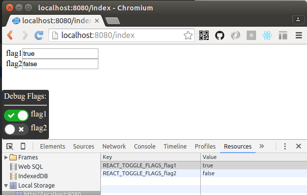

# react-toggle-flags

A component which will help toggling boolean flags easily in your app.

## Install

```sh
npm install react-toggle-flags
```

## Usage:

### Show control pannel

```js
import  DebugToolbar from 'react-debug-toolbar';
import  'style!css!react-debug-toolbar/style.css';
import  'style!css!react-toggle/style.css';

const demo = <DebugToolbar variables={["flag1","flag2"]}/>
```

### Read flag value

```js
import {DebugBoolean} from '../lib/DebugToolbar.jsx';

if(DebugBoolean('flag1')){
  ...
}
```
### Development

```sh
npm start
```

### Screenshot



## License

MIT